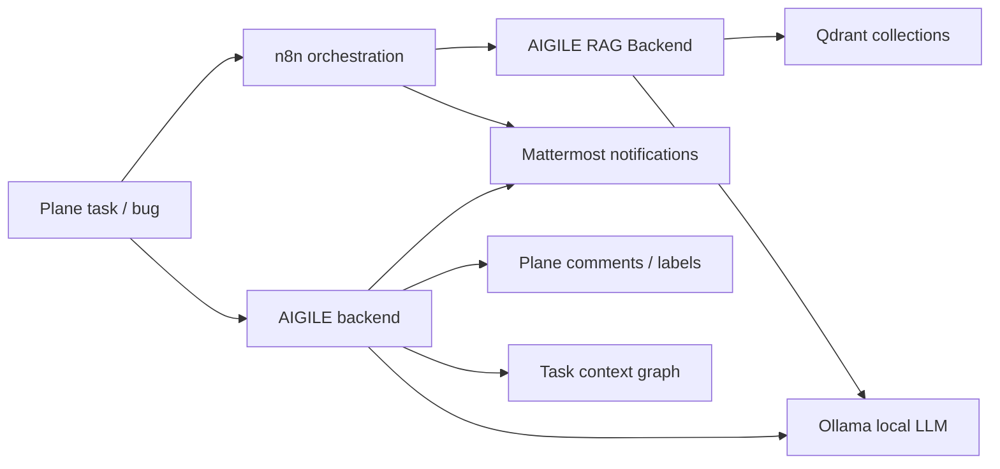

# AIGILE / Local AI Delivery Platform

Fully local MVP for AI-assisted delivery on Windows + Docker Desktop.

Current local version: `AIGILE 0.1.1-dev`.

Local knowledge artifacts for this version:

- `ai-delivery-app/rag-data/project_docs/aigile-feature-list.md`
- `ai-delivery-app/rag-data/project_docs/aigile-release-notes.md`
- `ai-delivery-app/rag-data/project_docs/aigile-product-audit-2026-06-04.md`
- `ai-delivery-app/rag-data/project_docs/aigile-0.1.1-system-summary.md`
- `ai-delivery-app/rag-data/project_docs/aigile-0.1.0-system-summary.md`
- `ai-delivery-app/rag-data/project_docs/aigile-smoke-test-pack.md`
- `ai-delivery-app/rag-data/project_docs/aigile-task-chat-user-guide.md`
- `ai-delivery-app/rag-data/decision_log/aigile-0.1.0-product-decisions.md`

## Product Maturity

AIGILE is a local MVP / demo-ready prototype, not a production SaaS product.

What is real and working locally:

- Docker-based local runtime for Plane, Mattermost, n8n, Ollama, Qdrant, RAG backend, and AIGILE backend.
- Plane AI Review Gate with agent routing, green/yellow/red review results, and local review history.
- Mattermost task threads with task context memory and explicit human approval before Plane updates.
- Local RAG collections, document ingestion, Plane Pages sync, and `/kb` knowledge search.
- Delivery Signals and Daily Delivery Brief based on available Plane, AI Review, and Mattermost signal data.

What is intentionally demo / heuristic:

- Daily Brief health and flow metrics are explainable management indicators, not mathematically validated forecasts.
- Some runtime demo data can be seeded/reset for interviews and product demos.
- Plane UI changes are implemented as local patches and can require maintenance when Plane changes.

Detailed audit: `ai-delivery-app/rag-data/project_docs/aigile-product-audit-2026-06-04.md`.

## Services

- Plane: http://localhost:8080
- Mattermost: http://localhost:8065
- n8n: http://localhost:5678
- AIGILE backend: http://localhost:8091
- Delivery Intelligence Dashboard: http://localhost:8091/delivery-dashboard
- Daily Delivery Brief: http://localhost:8091/daily-delivery-brief
- AIGILE RAG backend: http://localhost:8092
- Qdrant: http://localhost:6333
- Ollama API: http://localhost:11434
- Open WebUI: http://localhost:3001

All runtime services are local and connected through Docker network `ai-delivery-net`.

## Architecture



Plane remains the source of truth. n8n remains the orchestration layer. Ollama remains local inference. Mattermost remains the notification layer. Notion is project knowledge documentation, not a runtime dependency.

## Start

```powershell
.\start-plane.ps1
.\start-mattermost.ps1
.\start-ai-delivery.ps1
```

The AI delivery compose now starts:

- `n8n`
- `ollama`
- `open-webui`
- `aigile-backend`
- `rag-backend`
- `qdrant`

## Stop

```powershell
.\stop-ai-delivery.ps1
.\stop-mattermost.ps1
.\stop-plane.ps1
```

## Configuration

Local configuration lives in:

```text
ai-delivery-app/.env
```

Secrets stay in `.env` and are not duplicated in workflow JSON or README. n8n reads:

- `N8N_WEBHOOK_TOKEN`
- `MATTERMOST_WEBHOOK_URL`
- `RAG_BACKEND_URL`
- `OLLAMA_MODEL`

## Local Knowledge Documents

AIGILE keeps project knowledge locally in `ai-delivery-app/rag-data`.

Version `0.1.0` introduced these project documents:

```text
ai-delivery-app/rag-data/project_docs/aigile-feature-list.md
ai-delivery-app/rag-data/project_docs/aigile-release-notes.md
ai-delivery-app/rag-data/project_docs/aigile-0.1.0-system-summary.md
ai-delivery-app/rag-data/project_docs/aigile-smoke-test-pack.md
ai-delivery-app/rag-data/decision_log/aigile-0.1.0-product-decisions.md
```

These files are intended for local RAG ingestion and later Notion publication if needed.

## Smoke Test Pack

Standard regression checklist:

```text
ai-delivery-app/rag-data/project_docs/aigile-smoke-test-pack.md
```

Run it after changes to:

- AIGILE backend;
- Plane UI patches;
- Mattermost task chat;
- RAG backend;
- Docker Compose;
- n8n workflows.

The pack covers:

- service health;
- Plane AI Review Gate;
- missing type label guard;
- Mattermost task thread;
- chat-to-Plane approval;
- `/kb` RAG query;
- document upload ingestion;
- Plane Pages sync;
- git safety checks.

## Live Demo Seed / Reset

Use this before an interview or live product demo when you need predictable Plane work items for showing AIGILE capabilities.

The demo pack creates or restores only work items with:

- label: `AIGILE-DEMO`
- title prefix: `[DEMO]`

It does not touch ordinary Plane data without the demo title/label.

### Seed demo data

```powershell
.\seed-demo.ps1
```

Equivalent container command:

```powershell
$env:DOCKER_HOST='tcp://127.0.0.1:2375'
$env:DOCKER_CONFIG=(Join-Path (Get-Location) '.docker-config')
docker exec ai-delivery-app-aigile-backend-1 python /app/backend/aigile_backend.py seed-demo
```

### Reset demo data

```powershell
.\reset-demo.ps1
```

Reset restores the demo issues to their original titles, descriptions, state, priority, and labels.
It also removes non-demo labels from those demo issues so the next demo starts clean.

### Demo issues

The seed creates four intentionally imperfect work items in `AIGILE Platform`:

- `[DEMO] Story - Customer can request delivery slot`
- `[DEMO] Bug - Payment confirmation is not shown after successful payment`
- `[DEMO] Epic - AI-assisted backlog refinement`
- `[DEMO] Tech Debt - Refactor AI review orchestration`

Each issue has the `AIGILE-DEMO` label plus the correct type label: `Story`, `Bug`, `Epic`, or `Tech Debt`.

### Manual verification

1. Open the health dashboard: http://localhost:8091/dashboard
2. Confirm all services are green.
3. Run `.\reset-demo.ps1`.
4. Open Plane: http://localhost:8080/aigile/projects/882d9973-7e7d-4ad7-ba0f-df2f1c28e825/issues/
5. Find issues with `[DEMO]` in the title.
6. Open the Story demo issue and run `AI анализ`.
7. Confirm Agent Router selects Story agents and returns useful yellow/red findings.
8. Open the Bug demo issue and run `AI анализ`.
9. Confirm QA returns red or strong yellow because expected/actual result, reproduction steps, and environment are missing.
10. Use `В Mattermost` after AI review to show the task thread flow.

### Demo readiness note

The demo seed/reset does not require the LLM to be warm.
AI Review Gate does require Ollama inference. Before an interview, run one short AI analysis or a short Ollama chat request a few minutes before the live demo so the model is loaded.
If Ollama cold-start is slow, use the health dashboard and demo issues first, then run AI Review after the model is ready.

## Health Dashboard

Human-readable local status page:

```text
http://localhost:8091/dashboard
```

## Delivery Intelligence Dashboard

Management morning brief:

```text
http://localhost:8091/delivery-dashboard
```

Daily Delivery Brief:

```text
http://localhost:8091/daily-delivery-brief
```

Machine-readable report:

```text
http://localhost:8091/api/delivery-intelligence
```

Machine-readable daily brief:

```text
http://localhost:8091/api/daily-delivery-brief
```

Use it after the health dashboard when you want to show delivery-level signals:

- executive Project Health Index;
- schedule confidence based on current risks and blockers;
- several brief modes: Executive, Risks, Team Signals, Data Quality;
- infographic-style management summary for live demo;
- executive insight: situation, business impact, decision focus, next 24h, watchlist;
- Kanban flow metrics: throughput, lead time, cycle time, WIP, blocked time, flow efficiency, WIP aging, rework rate;
- green/red direction indicators for metric movement versus previous leadership sync;
- expandable metric history for director sync discussions;
- overall delivery status;
- reviewed vs unreviewed work items;
- green/yellow/red AI Review counts;
- AI-ranked top risks from AI review findings and team discussion signals;
- blockers and unresolved red items;
- requirement quality signals;
- module signals;
- decisions needed;
- Mattermost thread delivery signals;
- open questions and action items;
- daily delivery brief for interviews and morning management review;
- suggested actions for today.

The dashboard is intentionally honest: unavailable historical comparison is shown as unavailable instead of being faked. Project Health Index is a simple explainable score, not a forecast engine: it reacts to blockers, red/yellow reviews, weak requirements, open thread signals, and AI-ranked risks.

Manual check:

1. Open http://localhost:8091/dashboard and confirm services are OK.
2. Run `.\reset-demo.ps1` if you need predictable demo issues.
3. Open http://localhost:8091/delivery-dashboard.
4. Confirm Morning Brief, Delivery Health, Top Risks, Requirement Quality, Decisions Needed, and Suggested Actions are visible.
5. Open http://localhost:8091/api/delivery-intelligence and confirm JSON returns `ok: true`.
6. Open http://localhost:8091/daily-delivery-brief and confirm Executive Summary, Top 5 Risks, Top Blockers, Decisions Needed, Requirement Quality Issues, Changes Since Yesterday, and Suggested Actions are visible.
7. Open http://localhost:8091/api/daily-delivery-brief and confirm JSON returns `ok: true`.

Optional Mattermost send:

```powershell
$body = @{ channel_id = "<mattermost-channel-id>" } | ConvertTo-Json
Invoke-RestMethod -Uri "http://127.0.0.1:8091/api/daily-delivery-brief/send" -Method Post -ContentType "application/json" -Body $body
```

The brief does not invent facts. If data is missing, it says so directly, for example:

- `No critical risks found in available data.`
- `No meeting/thread signals available.`
- `Historical comparison is not available yet.`

Mattermost task thread signals:

```text
!risk high there is a chance we miss demo scope
!blocker no access to payment sandbox
!dep waiting for backend endpoint
!decision use variant B for MVP
!question who owns final copy approval?
!action assign QA owner before release
```

Signals are saved locally in:

```text
ai-delivery-app/logs/delivery-signals.jsonl
```

API:

```text
GET  /api/delivery-signals
GET  /api/delivery-signals?status=open
POST /api/delivery-signals/status
```

Status update body:

```json
{ "id": "signal-id", "status": "acknowledged" }
```

Machine-readable status:

```text
http://localhost:8091/healthz
```

The dashboard checks:

- AIGILE backend;
- Plane database;
- Plane web;
- Mattermost;
- n8n;
- Ollama;
- AIGILE RAG backend;
- Qdrant;
- Open WebUI.

Use this before the smoke test pack. If the dashboard is degraded, fix the failing service first.

## RAG Backend

Source:

```text
ai-delivery-app/rag-backend/rag_backend.py
```

API:

```text
GET  /health
POST /rag/ingest
POST /rag/query
POST /rag/analyze-issue
POST /context/search
POST /collections/list
```

Example checks:

```powershell
curl.exe -sS http://localhost:8092/health

$body = @{ query = "Plane webhook n8n Mattermost"; collection = "technical_docs"; limit = 3 } | ConvertTo-Json
Invoke-RestMethod -Uri "http://127.0.0.1:8092/rag/query" -Method Post -ContentType "application/json" -Body $body
```

## Collections

Qdrant collections:

```text
knowledge_books
project_docs
plane_pages
technical_docs
team_context
decision_log
prompt_registry
```

Documents are not mixed into one collection.

## Documents

Local folder structure:

```text
ai-delivery-app/rag-data/
  knowledge_books/
  project_docs/
  plane_pages/        # collection exists in Qdrant; content is synced from Plane Pages, not local files
  technical_docs/
  team_context/
  decision_log/
  prompt_registry/
```

Supported for MVP:

- `.md`
- `.txt`
- `.json`
- text-based `.pdf`

PDF support is MVP-level: it extracts text where available, logs failures, and skips files that cannot be parsed safely.

Metadata stored per chunk:

```text
source_type
collection
title
author
project
tags
created_at
updated_at
version
language
access_level
source_path
```

For `.json`, optional metadata can be provided as:

```json
{
  "metadata": {
    "title": "Example",
    "tags": ["delivery"]
  },
  "text": "Document body"
}
```

## Ingest

Index all local documents:

```powershell
Invoke-RestMethod -Uri "http://127.0.0.1:8092/rag/ingest" -Method Post -ContentType "application/json" -Body "{}"
```

Index selected collections:

```powershell
$body = @{ collections = @("technical_docs", "decision_log") } | ConvertTo-Json
Invoke-RestMethod -Uri "http://127.0.0.1:8092/rag/ingest" -Method Post -ContentType "application/json" -Body $body
```

## Plane Pages Project Knowledge

Plane Pages can be used as strict project knowledge for agents.

MVP rules:

- only `AIGILE Platform` is synced;
- only Public pages are synced;
- only page titles containing `[AI]` are synced;
- removed, archived, private, or unapproved pages are removed from `plane_pages`;
- `[AI] AIGILE Agent Rules` is bootstrapped as the default strict rules page.

Manual admin sync:

```powershell
Invoke-RestMethod -Uri "http://127.0.0.1:8091/api/sync-plane-pages" -Method Post -ContentType "application/json" -Body "{}"
```

Daily refresh runs a separate Plane Pages sync step after normal file-based RAG ingest.

Integration:

- AI Review Gate queries `plane_pages` with task type and selected agent names.
- Mattermost task chat queries `plane_pages` with `Task Chat Agent`, `AIGILE Agent Rules`, and the active task-thread context.
- Plane Pages rules are treated as strict project knowledge when present.

Embeddings are local. Default MVP mode is `local-hash`, with optional Ollama embeddings via:

```text
RAG_EMBEDDING_PROVIDER=ollama
RAG_EMBEDDING_MODEL=nomic-embed-text
```

## n8n Workflows

Existing workflow is preserved:

```text
n8n-workflows/ai-delivery-assistant.workflow.json
n8n-workflows/ai-delivery-assistant.backup.workflow.json
```

New RAG workflows:

```text
n8n-workflows/ai-delivery-assistant-rag.workflow.json
n8n-workflows/daily-rag-refresh.workflow.json
n8n-workflows/mattermost-rag-commands.workflow.json
```

Production webhook paths:

```text
POST /webhook/plane-ai-delivery-rag/
POST /webhook/mattermost-rag-command/
```

The old Plane webhook is not removed. Switch Plane to the RAG webhook only when you are ready to make RAG the default event flow.

## Plane To RAG To Mattermost Test

Smoke test without changing Plane settings:

```powershell
$token = (Get-Content .\ai-delivery-app\.env | Where-Object { $_ -like "N8N_WEBHOOK_TOKEN=*" }) -replace "^N8N_WEBHOOK_TOKEN=", ""
$body = @{
  issue = @{
    name = "RAG smoke test"
    description_stripped = "Check n8n to RAG backend to Mattermost."
    priority = "medium"
    state_detail = @{ name = "Backlog" }
    project_detail = @{ name = "AIGILE Platform" }
  }
} | ConvertTo-Json -Depth 8

Invoke-RestMethod -Uri "http://127.0.0.1:5678/webhook/plane-ai-delivery-rag/?token=$token" -Method Post -ContentType "application/json" -Body $body -TimeoutSec 300
```

Expected result:

```json
{ "ok": true, "message": "AI Delivery Assistant RAG processed the Plane event." }
```

Mattermost receives a short message with a hidden `<details>` full analysis block.

## Mattermost Commands

Base commands are routed through n8n:

```text
/knowledge
/project
/tech
/team
/decision
```

Collection mapping:

```text
/knowledge -> knowledge_books
/project   -> plane_pages
/tech      -> technical_docs
/team      -> team_context
/decision  -> decision_log
```

Mattermost slash commands should point to:

```text
http://n8n:5678/webhook/mattermost-rag-command/
```

From Windows host for local testing:

```powershell
$body = @{ command = "/decision"; text = "why did we choose n8n" } | ConvertTo-Json
Invoke-RestMethod -Uri "http://127.0.0.1:5678/webhook/mattermost-rag-command/" -Method Post -ContentType "application/json" -Body $body
```

## Mattermost RAG Channels

Mattermost can be used as an ingestion interface for local RAG knowledge.

Feature flag:

```text
MATTERMOST_RAG_INGEST_ENABLED=true
```

Channel mapping lives in `.env` as JSON:

```text
MATTERMOST_RAG_CHANNELS_JSON={"channels":{"ncjbqzw9x3db3n49to19e71hqa":{"channel_name":"knowledge-books","collection":"knowledge_books"}}}
```

Example mapping:

```json
{
  "channels": {
    "MATTERMOST_CHANNEL_ID": {
      "channel_name": "knowledge-books",
      "collection": "knowledge_books"
    }
  }
}
```

Example channel plan:

```text
knowledge-books  -> knowledge_books
project-docs     -> project_docs
tech-docs        -> technical_docs
team-context     -> team_context
decision-log     -> decision_log
prompt-registry  -> prompt_registry
```

Template file:

```text
ai-delivery-app/mattermost-rag-channels.example.json
```

Workflow files:

```text
n8n-workflows/mattermost-rag-channel-ingest.workflow.json
n8n-workflows/mattermost-knowledgebase-command.workflow.json
n8n-workflows/mattermost-kb-poll.workflow.json
```

Webhook paths:

```text
POST /webhook/mattermost-rag-ingest/
POST /webhook/mattermost-knowledgebase/
```

RAG backend endpoints:

```text
POST /rag/ingest-text
POST /rag/ingest-file
POST /rag/answer
POST /mattermost/poll-rag
```

The active Mattermost command is `/kb <query>`. It maps to RAG collection alias `knowledgebase`, which resolves to `knowledge_books`.

Active channel:

```text
Knowledge Books / knowledge-books / ncjbqzw9x3db3n49to19e71hqa -> knowledge_books
```

Safety behavior:

- ingest is disabled unless `MATTERMOST_RAG_INGEST_ENABLED=true`;
- text is ingested only when `channel_id` exists in `MATTERMOST_RAG_CHANNELS_JSON`;
- ordinary channels are ignored;
- unknown collections are rejected;
- user-facing errors are short and do not expose stack traces.

Current MVP note:

- channel ingestion is handled by the `Mattermost KB Poll` n8n workflow every minute;
- the poller reads only configured Mattermost channel IDs;
- text posts and attached files from `knowledge-books` are ingested into `knowledge_books`;
- supported file text extraction: `.txt`, `.md`, `.json`, text PDFs via `pypdf`;
- scanned PDFs without OCR are not extracted in this MVP.

Smoke test:

```powershell
$body = @{
  channel_id = "ordinary-channel"
  channel_name = "town-square"
  text = "Agile ordinary channel should not ingest"
  user_name = "smoke"
  post_id = "ordinary-1"
} | ConvertTo-Json
Invoke-RestMethod -Uri "http://127.0.0.1:5678/webhook/mattermost-rag-ingest/" -Method Post -ContentType "application/json" -Body $body
```

Expected for an ordinary channel:

```json
{ "ok": true, "ignored": true }
```

Knowledgebase command smoke test through n8n:

```powershell
$body = @{ text = "что такое Agile?" } | ConvertTo-Json
Invoke-RestMethod -Uri "http://127.0.0.1:5678/webhook/mattermost-knowledgebase/" -Method Post -ContentType "application/json" -Body $body -TimeoutSec 240
```

User-facing smoke test:

1. Open Mattermost at `http://localhost:8065`.
2. Go to `Knowledge Books`.
3. Upload a `.txt`, `.md`, `.json`, or text `.pdf` file with knowledge content.
4. Wait up to one minute for `Mattermost KB Poll`.
5. In any Mattermost channel, run `/kb <your question>`.
6. The response should answer from `knowledge_books` and include a collapsed context block.

`/kb` supports conversational follow-ups without Mattermost threads. The RAG backend stores a short local history by `collection + channel_id + user_id`.

```text
/kb вопрос
/kb уточняющий вопрос
/kb --short короткий ответ
/kb --deep подробный ответ
/kb --reset
```

## Daily Refresh

Workflow:

```text
Daily RAG Refresh
```

Schedule:

```text
06:00 every day
```

Logic:

1. Call `POST /rag/ingest`.
2. Refresh all collections.
3. Post a short report to Mattermost.

## Current Notes

- Qdrant persistence uses Docker volume `ai-delivery-app_qdrant-data`.
- RAG documents live in `ai-delivery-app/rag-data`.
- RAG backend is intentionally API-only; no complex UI in this MVP step.
- The Plane `AI анализ` button uses `aigile-backend` for AI Review Gate MVP 1. It renders review results inside Plane and does not modify issue fields.

## Plane AI Review Gate

Feature flag:

```text
AIGILE_AI_REVIEW_GATE_ENABLED=true
```

Backend endpoints:

```text
POST /api/review-task
GET /api/review-history?issue_key=AIGILE-123
```

MVP 1 is review-only: it detects task type, routes to role-based agents, returns green/yellow/red statuses, stores review history in `ai-delivery-app/logs/ai-review-history.jsonl`, and never applies AI changes to Plane tasks.

Plane Community does not provide reliable custom work item types for this MVP, so AIGILE uses labels as the source of truth for type detection. Add exactly one type label to each work item when possible:

```text
bug
story
epic
task
tech-debt
research
release
```

If no type label is present, AIGILE blocks AI analysis before any agent or LLM call. This prevents routing a work item to the wrong agent set. Explicit title prefixes like `[Bug]` or `Bug:` are supported only as a fallback for internal detection, not as the main process.

### AI Review Gate MVP 2

MVP 2 adds manual AI review comments. A user can open an agent result in the Plane `AI Review` panel and click `Отправить в комментарии`.

The backend endpoint is:

```text
POST /api/apply-review-suggestion
```

The apply action is intentionally conservative:

- it requires an existing `review_id`;
- `AI анализ` adds label `AI-R`;
- `Отправить в комментарии` creates a Plane issue comment;
- `Отправить в комментарии` adds label `AI-A`;
- it stores comment snapshots in `ai-delivery-app/logs/ai-apply-history.jsonl`;
- it does not write AI recommendations into the issue description.

After any apply action, the task must be reviewed by a human before delivery.

### AI Review Gate MVP 3

MVP 3 adds task-scoped Mattermost communication.

After `AI анализ`, the Plane review panel can show:

```text
В Mattermost
```

The backend endpoint is:

```text
POST /api/start-task-chat
```

The action:

- starts a direct Mattermost conversation with the configured user;
- sends the first task message from local user `aigile-agent`;
- includes issue key, title, detected type, review status, and Plane link;
- includes agent summaries from the latest review;
- builds and stores a task context graph in `ai-delivery-app/logs/task-chat-context.jsonl`.
- treats the first Mattermost post as the root task card;
- processes user replies in that Mattermost thread;
- replies from `aigile-agent` in the same thread;
- keeps per-thread dialogue history in local state;
- creates a pending draft when the user asks to change the task;
- applies the draft only after explicit approval;
- writes approved non-AC drafts to Plane comments and adds `AI-A`;
- for approved `!ac` drafts, updates the task description `Acceptance Criteria` block, marks the added line with `[AI]`, adds `AIA`, and leaves only a short summary comment;
- resolves follow-up phrases such as `добавь их в задачу` from the previous agent message when that message contains acceptance criteria;
- stores thread poll state in `ai-delivery-app/logs/task-chat-thread-state.json`.

Task chat confirmation is intentionally short:

```text
y / да  -> apply pending draft
n / нет -> discard pending draft
```

Quick prefixes:

```text
!ac       acceptance criteria
!note     general note
!risk     risk
!dep      dependency
!deadline deadline note
```

Thread polling is controlled by:

```text
AIGILE_TASK_CHAT_THREAD_ENABLED=true
AIGILE_TASK_CHAT_POLL_SECONDS=8
AIGILE_TASK_CHAT_STATE_PATH=/data/logs/task-chat-thread-state.json
```

The task context graph includes:

- current issue;
- parent chain;
- children;
- incoming and outgoing relations;
- cycles;
- modules;
- latest AI review.

This allows task-chat agents to answer with parent epic and delivery context directly in the Mattermost thread.

Current limitation: only approved `!ac` updates edit the task description. Other approved chat-to-Plane updates are still written as comments only. Direct field edits such as due date updates remain reserved for a later, narrower approval flow.

## Release Notes

Current release notes live in:

```text
ai-delivery-app/rag-data/project_docs/aigile-release-notes.md
```

Current version:

```text
AIGILE 0.1.0
```

When the user asks to record a release, update the local release notes first. Do not publish to Notion unless explicitly requested.
